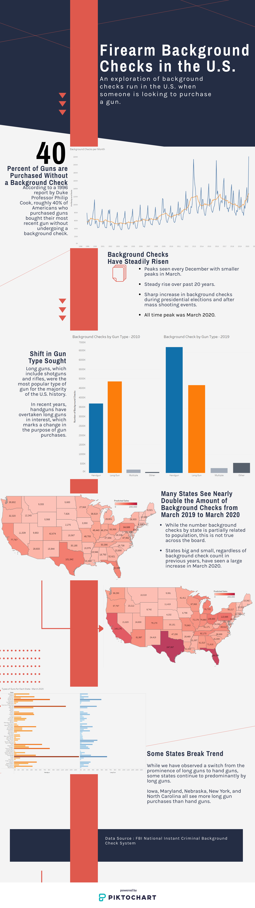

# Firearm Background Checks

The infographic explores the FBI's National Institute Criminal Background Check System database. It contains background checks
on gun purchases going back to 1998 and is widey considered to be the best proxy for gun sales in the United States.

The data used for this project can be found here: [FBI's National Instant Criminal Background Check System](https://www.fbi.gov/about-us/cjis/nics).

